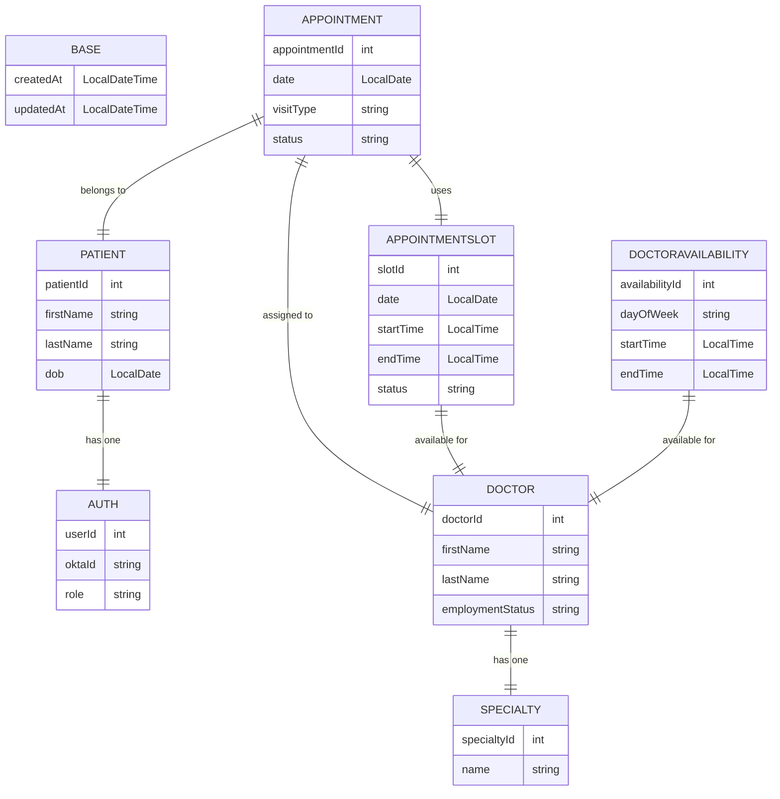

# York Medical Appointment Booking Portal

## Table of Contents

<a href="#prerequisites">Prerequisites</a>

<a href="#running-in-development">Running in Development</a>

<a href="#deploying-with-docker">Deploying with Docker</a>


## Prerequisites
Setup Okta 

Create:
- OIDC Web Application
- Authorization Server Policy with a new access rule using the default settings.
- "Admin" and "Patients" groups
- 2 - Test users assign one to each group (Admin & Patients)

Configure:
- groups claim to be permitted on authorization server

Optional - Download Docker (Or Docker Desktop) to <a href="#deploying-with-docker">deploy</a> the application. Otherwise you can just <a href="#running-in-development">run it in development mode</a>


## Running in Development
1. Set okta variables in application-dev.properties
```bash
okta.oauth2.issuer=https://{okta_domain}/oauth2/default
okta.oauth2.client-id={client_id}
okta.oauth2.client-secret={client_secret}
```

2. Start Spring Boot API using the dev profile
```bash
cd springboot
./gradlew bootRun --args='--spring.profiles.active=dev'
```
3. Start React
```bash
cd react
npm install
npm run dev
```
4. Access the Application in the browser:
<a href="http://localhost:3000">http://localhost:3000/</a>

Note: Do not run the application in the same browser as the Okta Dashboard. The SSO feature will automatically log in to your application and will prevent access adjustment unless you're logged out of okta.

## Deploying with Docker
1. Set environment variables in docker-compose.yml
```bash
OAUTH2_ISSUER: https://{okta_domain}/oauth2/default
OAUTH2_CLIENT_ID: {client_id}
OAUTH2_CLIENT_SECRET: {client_secret}
```
2. Start the containers with Docker Compose
```bash
docker-compose up --build
```
3. Access the Application in the browser: <a href="http://localhost">http://localhost</a>

4. Optional - Shut down and remove the containers when finished
```bash
docker-compose down
```
## Entity Relationship Diagram

